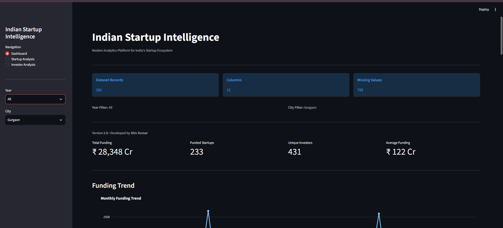
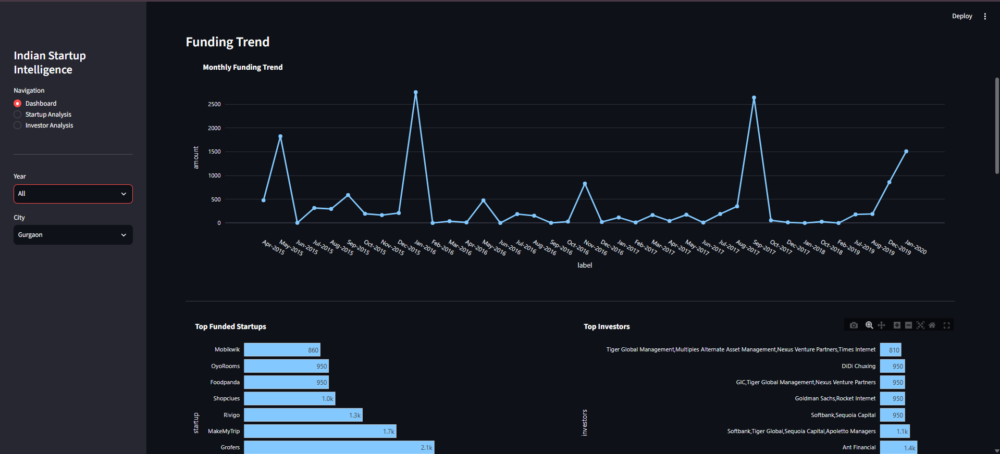
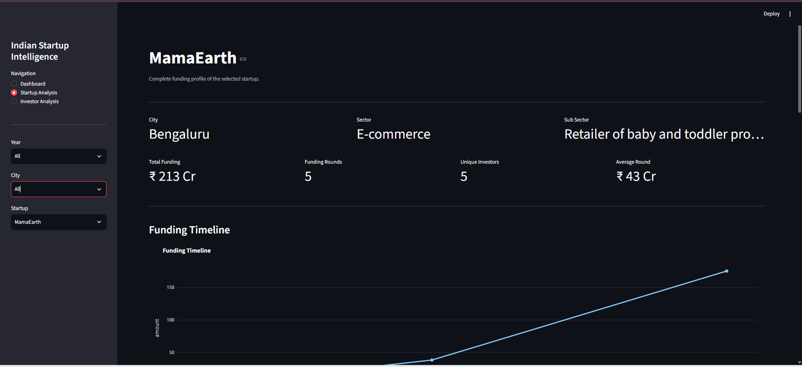
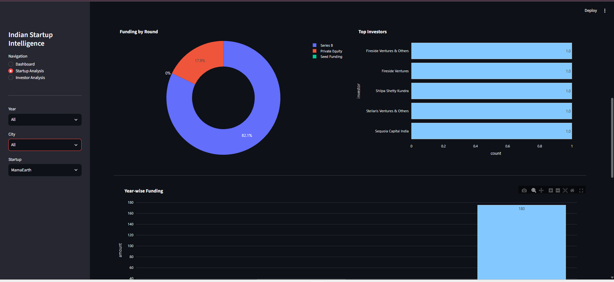
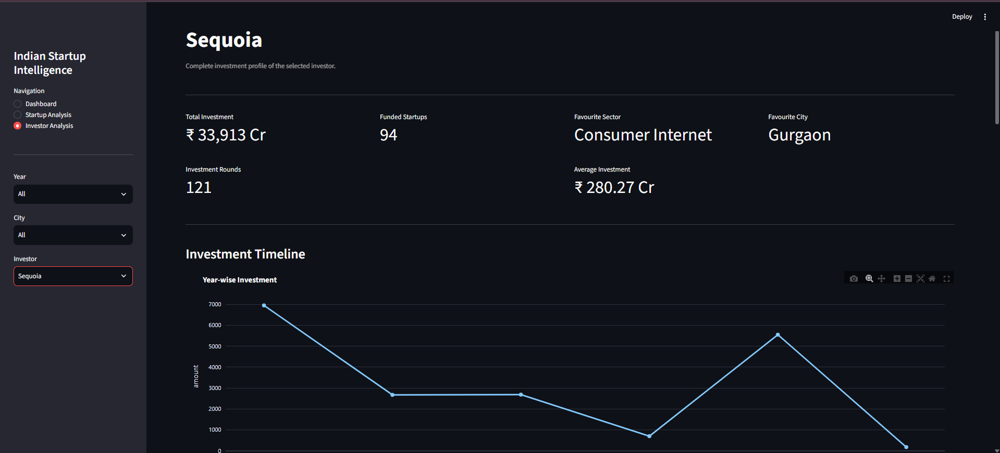
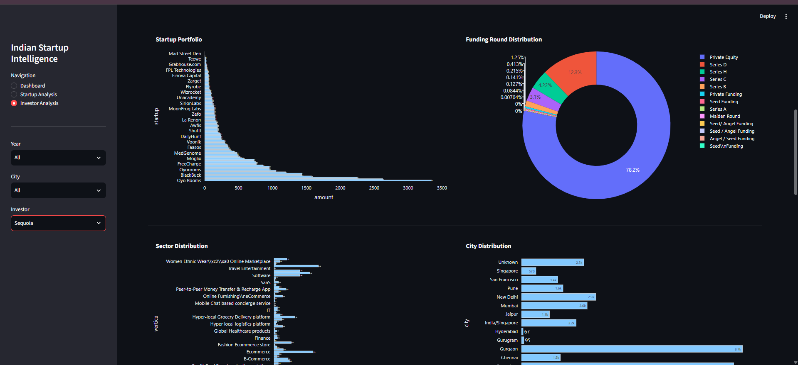

# Indian Startup Intelligence

A modular analytics platform for exploring India's startup funding ecosystem through interactive dashboards, startup analytics, and investor intelligence.

The application is built using **Python**, **Streamlit**, **Pandas**, and **Plotly**, following a layered architecture that separates the user interface, application logic, analytics engine, and data processing components. The architecture is designed to support future AI-powered analytics through Large Language Models (LLMs) and Retrieval-Augmented Generation (RAG).

---

## Application Preview

### Dashboard





---

### Startup Analysis





---

### Investor Analysis





---

## Features

### Dashboard

- Funding overview
- Total startups, investors, and funding
- Monthly funding trend
- Yearly funding trend
- Top funded startups
- Top investors
- Top cities
- Top sectors
- Funding round distribution
- Interactive charts

### Startup Analysis

- Startup profile
- Funding timeline
- Funding history
- Investor distribution
- Round-wise funding analysis
- Yearly funding trend
- Recent funding rounds

### Investor Analysis

- Investor profile
- Investment timeline
- Portfolio analysis
- Sector distribution
- City distribution
- Funding round analysis
- Largest investments
- Recent investments

### Global Filters

- Filter by Year
- Filter by City
- Dynamic Startup Selection
- Dynamic Investor Selection

All dashboards update automatically based on the selected filters.

---

## Architecture

The project follows a layered architecture where each component has a single responsibility.

```
                        Streamlit User Interface
                                  │
                                  ▼
                        Application Core Layer
                     (Routing • Navigation • Filters)
                                  │
                                  ▼
                          Analytics Layer
         ┌──────────────────────┼──────────────────────┐
         ▼                      ▼                      ▼
 Dashboard Analytics     Startup Analytics    Investor Analytics
                                  │
                                  ▼
                        Data Processing Layer
               (Loader • Validator • Cleaner)
                                  │
                                  ▼
                         startup_cleaned.csv
```

---

## Project Structure

```
Indian Startup Intelligence
│
├── app.py
├── config.py
├── requirements.txt
├── README.md
├── .gitignore
│
├── assets/
│   ├── style.css
│   └── screenshots/
│
├── core/
│   ├── state.py
│   ├── navigation.py
│   ├── filters.py
│   ├── sidebar.py
│   └── router.py
│
├── data/
│   └── startup_cleaned.csv
│
├── llm/
│
├── pages/
│   ├── overall/
│   ├── startup/
│   └── investor/
│
├── tests/
│
└── utils/
    ├── loader.py
    ├── cleaner.py
    ├── validators.py
    ├── charts.py
    └── analytics/
```

---

## Technologies Used

| Category | Technology |
|-----------|------------|
| Language | Python 3.14 |
| Framework | Streamlit |
| Data Analysis | Pandas |
| Numerical Computing | NumPy |
| Visualization | Plotly |
| Version Control | Git |
| IDE | Visual Studio Code |

---

## Installation

Clone the repository

```bash
git clone https://github.com/shivkumar15/Indian-Startup-Intelligence.git
```

Move into the project directory

```bash
cd Indian-Startup-Intelligence
```

Create a virtual environment

```bash
python -m venv venv
```

Activate the virtual environment

### Windows

```bash
venv\Scripts\activate
```

### Linux / macOS

```bash
source venv/bin/activate
```

Install the required packages

```bash
pip install -r requirements.txt
```

Run the application

```bash
streamlit run app.py
```

---

## Development Principles

The project was developed following standard software engineering principles.

- Modular Architecture
- Separation of Concerns
- Configuration-Driven Design
- Reusable Components
- Scalable Folder Structure
- Future AI Integration
- Maintainable Codebase

---

## Future Roadmap

The architecture has been designed to support future enhancements without major structural changes.

Planned improvements include:

- Large Language Model (LLM) Integration
- Natural Language Querying
- Retrieval-Augmented Generation (RAG)
- AI-powered Startup Recommendation Engine
- PostgreSQL Integration
- User Authentication
- Cloud Deployment
- Real-time Startup Funding Data
- REST API Support

---

## Author

**Shiv Kumar**

B.Tech – Computer Science & Engineering (Artificial Intelligence & Machine Learning)

- GitHub: https://github.com/shivkumar15
- LinkedIn: www.linkedin.com/in/shiv-kumar-399198268

For questions, suggestions, or collaboration opportunities, feel free to connect.

---

## License

This project is licensed under the MIT License.
